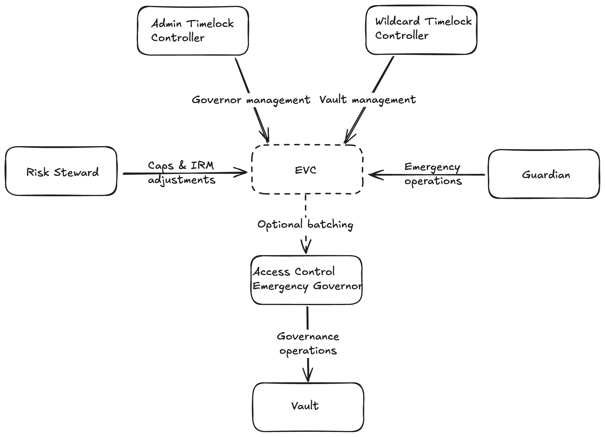

# Governor Access Control Emergency Factory

## Overview

The `GovernorAccessControlEmergencyFactory` is a specialized factory contract designed to deploy a comprehensive governance suite for Euler Vault Kit (EVK) vaults. This suite consists of a `GovernorAccessControlEmergency` contract and two vanilla OpenZeppelin timelock controllers with different permissions on the governor contract.

This document describes the purpose, components, and usage of the factory contract. For more detailed information about the governor contracts themselves, please refer to the [Selector Access Control documentation](./selector-access-control.md) that the governor contracts inherit from.

## Purpose

The primary purpose of the `GovernorAccessControlEmergencyFactory` is to simplify the deployment of a secure governance system for EVK vaults with:

1. **Time-delayed governance** - Critical parameter changes require passing through timelocks, giving users sufficient time to inspect proposed changes and decide whether they should stay or exit before changes take effect
2. **Emergency response capabilities** - Designated guardians can rapidly respond to risk events
3. **Role separation** - Different entities can be responsible for different governance actions

This factory is designed to support optimistic risk management workflows as described in [EIP 62: Optimistic risk management via timelocked risk stewards and limited rapid response](https://forum.euler.finance/t/eip-62-optimistic-risk-management-via-timelocked-risk-stewards-and-limited-rapid-response/1225) but is suitable and encouraged to be used by any EVK vault curator.

## Components

The factory deploys three interconnected contracts:

1. **GovernorAccessControlEmergency** - A specialized governor contract that provides both normal access control and emergency response functions. This contract inherits from `GovernorAccessControl` and adds emergency roles for rapid risk mitigation. See [selector-access-control.md](./selector-access-control.md) for more details.

2. **Admin Timelock Controller** - An OpenZeppelin `TimelockController` that holds the `DEFAULT_ADMIN_ROLE` on the governor contract. This timelock controls the administrative governance of the governor itself, including the ability to grant and revoke roles. It functions as a security backstop and is not typically used in day-to-day operations.

3. **Wildcard Timelock Controller** - An OpenZeppelin `TimelockController` that holds the `WILD_CARD` role on the governor contract. This timelock is intended for day-to-day governance of the vaults and oracle router.

### Timelock Security Model

The dual timelock model implements a security-focused governance approach:

- **Operational Governance** - The wildcard timelock handles routine parameter changes and can include external risk partners as proposers or executors.
  
- **Administrative Governance** - The admin timelock serves as a "break glass" mechanism, typically controlled exclusively by the DAO or vault curator.
  
- **Emergency Circuit Breaker** - If an external partner with privileges on the wildcard timelock were to become uncooperative, the admin timelock provides a fallback mechanism to revoke their access and emergency roles.

This separation of concerns ensures that while operational governance can be delegated to risk specialists, ultimate administrative control remains with the vault owner.

## User Protection Through Timelocks

The timelock controllers play a crucial role in protecting vault users by introducing mandatory waiting periods before governance actions take effect:

1. **Transparency** - All proposed changes must be submitted to the timelock first, making them visible to users and the broader community before execution
2. **Response window** - Users have time to evaluate how changes might impact their position and take appropriate action
3. **Exit opportunity** - If users disagree with pending changes, they have time to exit their positions before changes take effect
4. **Reduced governance risk** - The delay prevents malicious or erroneous changes from being executed immediately, allowing time for detection and intervention

This protection mechanism is especially important for parameter changes that could adversely affect users, such as adjustments to risk parameters or access controls.

## Deployment Parameters

The factory accepts the following parameters:

### TimelockControllerParams

For both the admin and wildcard timelock controllers:

- `minDelay`: The minimum time delay before a transaction can be executed (must be at least 1 day)
- `proposers`: Addresses allowed to propose transactions
- `cancellers`: Addresses allowed to cancel proposed transactions
- `executors`: Addresses allowed to execute transactions after the timelock (pass `address(0)` to keep the executor role open to anyone)

### Governor Emergency Guardians

- `governorAccessControlEmergencyGuardians`: Addresses that will be granted three emergency roles for rapid response, as defined in the [GovernorAccessControlEmergency](../src/Governor/GovernorAccessControlEmergency.sol) contract.

## Role Setup

Upon deployment, the factory:

1. Grants `DEFAULT_ADMIN_ROLE` on the governor to the admin timelock
2. Grants `WILD_CARD` role on the governor to the wildcard timelock
3. Grants emergency roles (`LTV_EMERGENCY_ROLE`, `HOOK_EMERGENCY_ROLE`, `CAPS_EMERGENCY_ROLE`) to each guardian
4. Configures proposers, executors, and cancellers for both timelocks
5. Renounces its own admin roles after setup

## Emergency Response Capabilities

Emergency guardians receive three distinct powers:

1. **Emergency LTV Adjustment** - Lower borrow LTV without changing liquidation LTV
2. **Emergency Vault Pausing** - Disable all operations on the vault
3. **Emergency Caps Lowering** - Lower supply and/or borrow caps

Important note: While emergency actions can be executed rapidly, recovering from emergency states (like unpausing a vault) requires going through the timelock process, so especially pausing the vault should be used carefully.

## Deployment Process

When deploying through the factory:

1. Prepare the parameters for both timelocks
2. Identify the emergency guardians
3. Call the `deploy` function with these parameters
4. Record the addresses of the deployed contracts
5. Install the `GovernorAccessControlEmergency` as the governor of your vault(s) and oracle router

## Post-Deployment Monitoring

After deployment, it is crucial to automatically add the deployed timelock controllers to the monitoring suite:

1. **Timelock changes detection** - Monitor any changes to critical timelock parameters, especially the `minDelay` value
2. **Proposed transaction tracking** - Track all transactions queued in the timelocks to ensure visibility of pending governance actions
3. **Role assignment monitoring** - Detect any changes to proposer, executor, or canceller roles

Proper monitoring ensures that governance remains transparent and that any attempts to modify the governance structure itself (e.g., reducing timelock delays) are detected and can be addressed.

## Practical Governance Workflow

The typical governance workflow after deployment would be:

1. **Day-to-day operations** - The wildcard timelock is used for routine parameter adjustments to vaults (LTVs, caps, etc.)
   
2. **Emergency responses** - Designated guardians can respond to market events by using their emergency roles directly
   
3. **Administrative changes** - The admin timelock would only be used for changes to the governance structure itself, such as:
   - Adding or removing guardians with emergency roles
   - Granting or revoking the selector access control roles as needed
   - Managing the role of the wildcard timelock

This separation ensures operational efficiency while maintaining strong security guarantees.

## Relationship to Existing Components

This factory builds upon the selector-based access control system described in the [Selector Access Control documentation](./selector-access-control.md). The core functionality comes from:

- `SelectorAccessControl`: Base contract providing selector-based access control
- `GovernorAccessControl`: Framework for forwarding calls to target contracts with access control
- `GovernorAccessControlEmergency`: Extension with specialized emergency response functions

## Conclusion

The `GovernorAccessControlEmergencyFactory` provides a streamlined way to deploy a complete governance system with timelocks and emergency response capabilities. This approach balances the need for careful governance with the ability to respond rapidly to emergencies, making it well-suited for managing risk parameters of the EVK vaults.

By enforcing time delays through timelocks, the system prioritizes user protection, giving vault users the transparency and time needed to assess and respond to governance changes. At the same time, the dual timelock architecture provides both operational flexibility and security guarantees, while the standardized factory deployment makes it easier to implement consistent monitoring across all governance instances, enhancing the security of the entire ecosystem.

## Governor Contracts Suite

