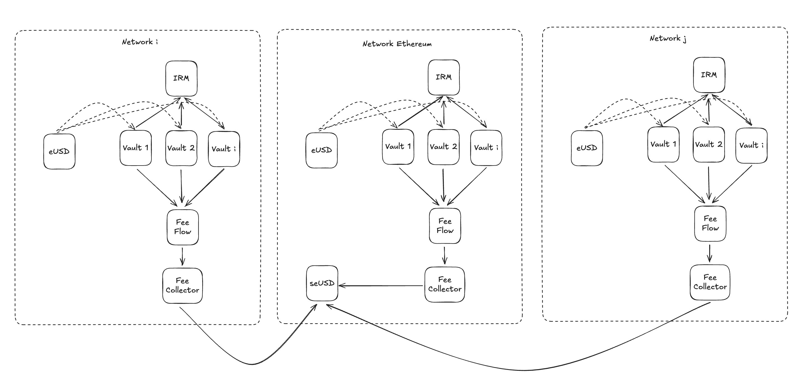

# Synthetic Assets and Fee Distribution Contracts

This document describes the new contracts introduced to support synthetic asset creation and automated fee distribution across the Euler Vault Kit ecosystem. These contracts extend the original synthetic asset system described in the Euler Vault Kit whitepaper with cross-chain capabilities and enhanced automation.

## Overview

The synthetic asset system consists of six main contracts that work together to enable cross-chain synthetic asset creation and automated fee collection/distribution:

1. **ERC20Synth** - A modified synthetic token contract for LayerZero OFT compatibility
2. **FeeFlowControllerEVK** - An enhanced fee auction controller for EVK vaults with automated fee conversion
3. **FeeCollectorUtil** - Base contract for fee collection functionality
4. **OFTFeeCollector** - Cross-chain fee collection orchestrator using LayerZero
5. **OFTFeeCollectorGulper** - Unified fee collection and distribution contract with both local and cross-chain capabilities
6. **IRMBasePremium** - Generic interest rate model with base rate and premium rate components

This system builds upon the original synthetic asset architecture described in the Euler Vault Kit whitepaper, which includes:
- **ESynth** - The original synthetic token contract
- **IRMSynth** - Reactive interest rate model for synthetic assets
- **EulerSavingsRate** - Interest-bearing vault with smearing mechanism
- **PegStabilityModule** - Peg stability mechanism for synthetic assets

## Contract Descriptions

### ERC20Synth

**Purpose**: A synthetic ERC-20 token designed for cross-chain operations with LayerZero OFT compatibility. This contract extends the original ESynth functionality to support cross-chain token bridging.

**Key Features**:
- Inherits from `ERC20BurnableMintable` (which currently acts as EUL implementation for non-Ethereum chains)
- Role-based access control using `AccessControlEnumerable`
- Minting capacity management per minter with LayerZero compatibility
- Total supply exclusion for vault addresses (same as original ESynth)
- EVC integration for account management
- Cross-chain mint/burn interface compatibility

**Key Changes from Original ESynth**:
- **Inheritance**: Changed from `Ownable` to `AccessControlEnumerable` for more granular permissions
- **Base Contract**: Now inherits from `ERC20BurnableMintable` instead of `ERC20EVCCompatible`
- **Minting Logic**: If minter capacity equals `type(uint128).max`, capacity is not decreased (for LayerZero infinite minting)
- **Burning Interface**: Added `burnFrom` function for LayerZero interface compatibility
- **EVC Check**: Removed `E_NotEVCCompatible` check as it's not strictly necessary
- **Core Mechanics**: Preserved the original synthetic asset mechanics (minting capacity, total supply exclusion, vault allocation)

**Roles**:
- `DEFAULT_ADMIN_ROLE`: Can grant/revoke roles and manage ignored addresses
- `MINTER_ROLE`: Can mint tokens up to their assigned capacity
- `REVOKE_MINTER_ROLE`: Can revoke minter role from addresses in emergency situations
- `ALLOCATOR_ROLE`: Can allocate/deallocate tokens to/from vaults

### FeeFlowControllerEVK

**Purpose**: An enhanced version of the FeeFlowController specifically designed for EVK vaults with automated fee conversion, optional payment token bridging via LayerZero OFT adapter and hook-based automation.

**Key Differences from Original FeeFlowController**:
- **Fee Conversion**: Automatically calls `IEVault(assets[i]).convertFees()` for each asset before transfer
- **LayerZero OFT Integration**: Supports bridging the payment token to a remote chain using a LayerZero OFT adapter. If `oftAdapter` is set, payment tokens are sent cross-chain to the configured receiver; otherwise, they are transferred locally.
- **Hook Support**: Added `hookTarget` and `hookTargetSelector` parameters for post-transaction automation

### FeeCollectorUtil

**Purpose**: Base contract that provides common fee collection functionality for multiple vaults.

**Key Features**:
- **Multi-Vault Support**: Manages a list of vaults for fee collection
- **Role-Based Access**: Separate roles for maintenance and collection operations
- **Asset Validation**: Ensures all vaults use the same underlying asset as the fee token
- **Fee Conversion**: Automatically converts fees and redeems vault shares
- **Token Recovery**: Emergency recovery functions for tokens and native currency

**Roles**:
- `DEFAULT_ADMIN_ROLE`: Can configure the contract and recover tokens
- `MAINTAINER_ROLE`: Can add/remove vaults from the collection list
- `COLLECTOR_ROLE`: Can execute the fee collection process

### OFTFeeCollector

**Purpose**: Collects fees from multiple vaults and sends them cross-chain via LayerZero OFT adapter.

**Key Features**:
- **Inherits from FeeCollectorUtil**: Uses base fee collection functionality
- **Cross-Chain Transfer**: Uses LayerZero OFT adapter for cross-chain fee distribution
- **OFT Validation**: Ensures OFT adapter token matches the fee token
- **Composed Messages**: Support for composed messages for automated interest smearing

### OFTFeeCollectorGulper

**Purpose**: Unified contract that combines local fee collection and cross-chain fee reception capabilities, depositing collected fees into an EulerSavingsRate contract with automated interest smearing.

**Key Features**:
- **Inherits from FeeCollectorUtil**: Uses base fee collection functionality for local operations
- **LayerZero Integration**: Implements `ILayerZeroComposer` for cross-chain message handling
- **Dual Operation Modes**: 
  - Local mode: Collects fees from multiple vaults and deposits them into ESR
  - Cross-chain mode: Receives fee tokens from remote chains and deposits them into ESR
- **EulerSavingsRate Integration**: Deposits collected fees into ESR contract
- **Interest Smearing**: Automatically calls `gulp()` to distribute interest over 2-week periods

### IRMBasePremium

**Purpose**: Generic interest rate model that provides a base rate plus a premium rate, with the ability to override premium rates for specific vaults.

**Key Features**:
- **Dual Rate Structure**: Interest rate = base rate + premium rate
- **Vault-Specific Overrides**: Individual vaults can have custom premium rates
- **Role-Based Administration**: Separate roles for rate management
- **EVC Integration**: Uses EVC for account management and authentication
- **Flexible Configuration**: Base and premium rates can be updated independently

**Roles**:
- `DEFAULT_ADMIN_ROLE`: Can grant/revoke roles and manage the contract
- `RATE_ADMIN_ROLE`: Can update base rate, premium rate, and vault-specific overrides

## System Integration Overview

The synthetic asset system creates a multi-chain ecosystem where synthetic tokens maintain their peg through EulerSwap pools rather than traditional peg stability modules. The system operates across multiple networks with a centralized interest distribution mechanism.

### Multi-Chain Token Deployment

The `ERC20Synth` contract will be deployed on multiple networks, each maintaining the same synthetic token but operating independently. These tokens inherit from `ERC20BurnableMintable`, making them compatible with LayerZero's OFT standard for seamless cross-chain transfers. Each deployment maintains its own minting capacity and role-based access control, allowing network-specific minters while preserving the core synthetic asset mechanics.

### Centralized Interest Distribution

A single canonical `EulerSavingsRate` (ESR) instance operates on Ethereum as the central hub for interest distribution. This ESR contract receives fees from all networks through the cross-chain fee collection system and distributes interest to depositors using its smearing mechanism over two-week periods. The centralized approach ensures consistent interest rates across all networks while maintaining the security and efficiency of the original ESR design.

### Network-Specific Vault Architecture

On each network, multiple synthetic asset vaults are created using the EVK system. These vaults are configured with hooks that restrict deposits to only the synthetic token itself, implementing the same security model as the original `ESynth` system. Each vault uses `IRMBasePremium` for flexible interest rate management, allowing different risk profiles and premium rates for different vaults while maintaining a consistent base rate structure.

The vaults are configured with 100% interest fees, meaning all interest generated from borrowing flows directly to the fee collection system rather than being distributed to depositors. This creates a revenue stream that can be efficiently collected and distributed through the cross-chain infrastructure.

### Fee Flow Orchestration

The `FeeFlowControllerEVK` operates on each network, periodically conducting Dutch auctions to sell the accumulated fees. Unlike the original system, this controller automatically calls `convertFees()` on all vaults before transferring assets, ensuring fees are properly converted to transferable tokens. The controller will be configured with either the `OFTFeeCollector` (for cross-chain distribution) or `OFTFeeCollectorGulper` (for local distribution) as a hook target to automate the fee collection process, seamlessly integrating with the broader fee distribution system.

### Cross-Chain Fee Collection

The fee collection system supports both local and cross-chain distribution through unified contracts:

**Local Distribution**: `OFTFeeCollectorGulper` contract can operate locally on Ethereum, collecting fees from multiple vaults and depositing them directly into local ESR instances with automated interest smearing.

**Cross-Chain Collection**: `OFTFeeCollector` contracts on each network collect fees from multiple vaults and send them cross-chain to Ethereum using LayerZero OFT adapters. These collectors inherit from `FeeCollectorUtil`, providing consistent fee collection logic while supporting composed messages for automated interest smearing.

**Cross-Chain Reception**: `OFTFeeCollectorGulper` contract on Ethereum receives the cross-chain fees and automatically deposits them into the canonical ESR instance. The contract implements LayerZero's composer interface, allowing it to receive fees and immediately trigger the `gulp()` function to distribute interest over the two-week smearing period.

### Peg Stability Through EulerSwap

Instead of using traditional peg stability modules, the system leverages EulerSwap pools to maintain synthetic asset pegs. These pools are created on top of the Euler lending infrastructure, allowing the same assets to simultaneously facilitate swaps, earn lending yield, and serve as collateral. This approach provides deeper liquidity and more efficient peg maintenance compared to traditional AMM mechanisms.

The EulerSwap integration enables just-in-time liquidity provision, where the protocol can borrow output tokens on-demand using input tokens as collateral. This mechanism can simulate up to 50x the depth of traditional AMMs, particularly effective for stable or pegged asset markets where pricing risk is minimal.

### Interest Rate Management

The `IRMBasePremium` system provides flexible interest rate management across all networks. Each IRM instance can serve multiple vaults with different risk profiles, using a dual-rate structure that separates base rates from risk premiums. Vault-specific overrides allow for customized pricing based on individual vault characteristics, while centralized control enables coordinated rate adjustments across the ecosystem.

The IRM also serves as a crucial peg stability mechanism. When synthetic assets trade below their target price, interest rates are raised, encouraging borrowers to repay their loans and creating buy pressure on the synthetic asset. Conversely, when synthetic assets trade above their target price, interest rates are lowered, reducing the incentive to repay and allowing the price to stabilize. This reactive interest rate adjustment works in conjunction with EulerSwap pools to maintain tight peg stability across all networks.

### Operational Flow

The complete system operates through a coordinated flow: vaults generate fees through normal lending operations, the fee flow controller periodically auctions these fees, fee collectors gather the proceeds from multiple vaults, and the cross-chain infrastructure transports these fees to the canonical ESR on Ethereum. The ESR then distributes interest to depositors using its smearing mechanism, while EulerSwap pools maintain synthetic asset pegs through efficient liquidity provision.

This architecture creates a sophisticated multi-chain synthetic asset system that combines the security of the original Euler Vault Kit with modern cross-chain infrastructure and efficient peg maintenance mechanisms, enabling synthetic assets to operate seamlessly across multiple networks while maintaining consistent interest distribution and peg stability.

